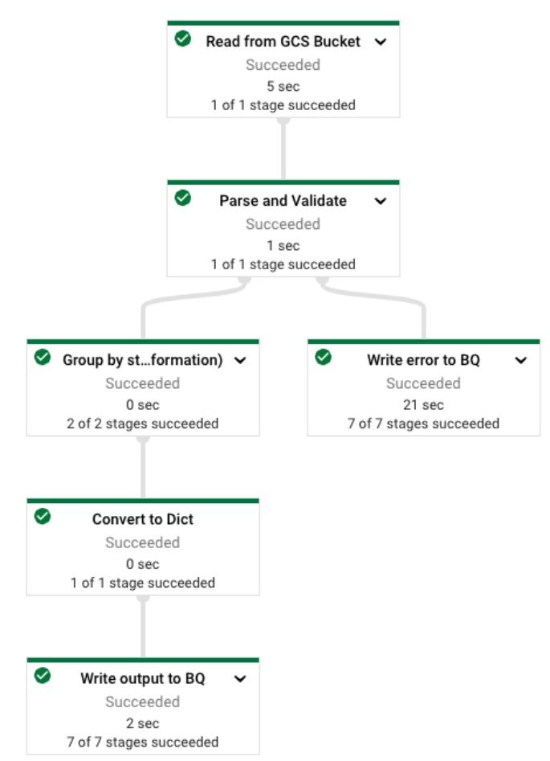
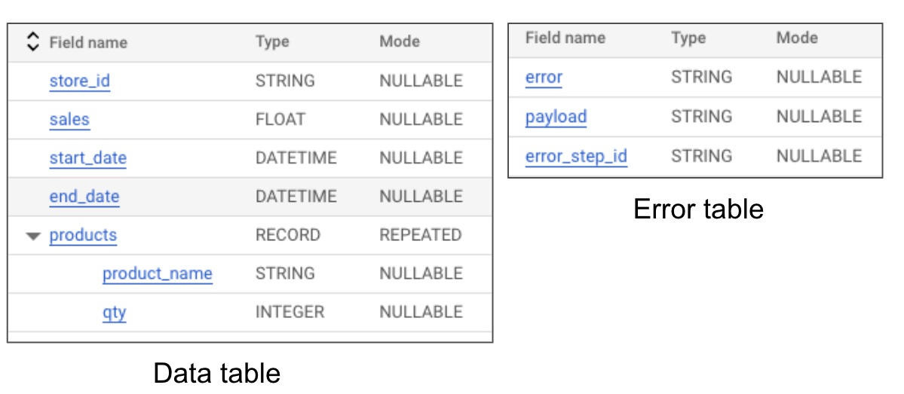
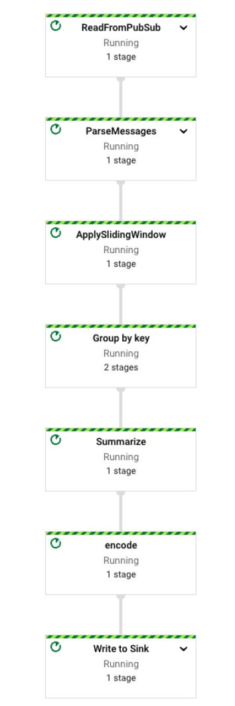

The repo contains the data-pipeline-testing.

- `sample-data` contains the data that is used to do integration test with input and output.
  - Create a `test_bucket` and upload the sample data
      ``` 
      export INPUT_BUCKET=<<name of the test_bucket>>
      gsutil mb ${INPUT_BUCKET}
      cd samaple-data
      gsutil cp -r . ${INPUT_BUCKET}
      ```

- `beam-testing-example` contains multiple examples including pardo, combinefxn, side input and windows.

  - Sub folder `excercise` contains somthing you can try. Solution is also included/

- `store-info-pipeline` contains a use case to read the csv files from GCS bucket and summarize the data based on the store_id and then number of products sold by the store.

 


GCS objects in CSV has data in the following format

```
txn_date, txn_id, store_id, prodcut_name, qty, amount
```

Data is written in the BigQiuery, Error recordsgoes to error table.

 

  - Run the unittest
  
    `python -m pytest test/store_info_batch_unittest.py`

  - Run the integration test
  
    ```
      export TEMP_LOCATION= <<set the temp gcs location>>
      export STAGING_LOCATION= <<set the staging location>>
      export PROJECT_ID=<project_id_to run the test and create bq dataset and tables>
      python -m pytest --log-cli-level=INFO test/store_info_batch_ittest.py --test-pipeline-options="--project=${PROJECT_ID} --runner=DataflowRunner --input=${INPUT_BUCKET} --temp_location=${TEMP_LOCATION} --staging_location=${STAGING_LOCATION} --setup=./setup.py"
    ```

- `taxi-rides-streaming-pipeline` contains a use case to reads from a PubSub and summarizes the ride status within a redefined sliding window.

 

   - Run the unittest
  
        ```
        python -m pytest test/store_info_batch_unittest.py
        ```
    - Run the integration test
        ```
        export TEMP_LOCATION=<<GCS_TEMP_LOCATION>>
        export STAGING_LOCATION=<<GCS_STAGING_LOCATION>
        export PROJECT_ID=<<PROJECT_ID>
        pytest --log-cli-level=INFO test/taxirides_ittest.py --test-pipeline-options="--runner=TestDataflowRunner --wait_until_finish_duration=100000 -temp_location=${TEMP_LOCATION}--staging_location=${STAGING_LOCATION} --project=${PROJECT_ID} --setup=./setup.py"
        ```